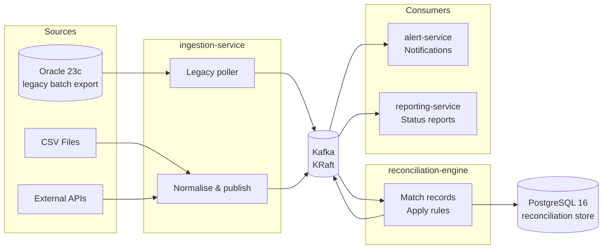

# Reconciliation Platform — Automated Multi-Source Transaction Matching

> Automatically detect and surface discrepancies between financial data sources — eliminating thousands of manual reconciliation hours.

---

## The Problem

Large enterprises (banking, insurance, retail) receive the same business data from multiple systems that rarely agree: a payment appears in the core banking system but is missing from the accounting ledger; an invoice is recorded differently in the ERP and the warehouse system. Reconciling these discrepancies manually is expensive, error-prone, and slow — often taking entire teams days to find mismatches that a rules engine can catch in seconds.

This platform ingests data from heterogeneous sources, normalises it, applies configurable matching rules, and emits real-time alerts and reports on every discrepancy found.

---

## Architecture



---

## Tech Stack

| Layer | Technology | Why |
|---|---|---|
| Language | Java 17 (LTS) | Enterprise standard; long-term support |
| Framework | Spring Boot 3.x | Production-grade microservices with minimal boilerplate |
| Build | Maven multi-module | Centralised version management; familiar in banking/legacy orgs |
| Messaging | Apache Kafka (KRaft) | High-throughput event streaming; KRaft removes Zookeeper complexity |
| DB — new system | PostgreSQL 16 | Reliable, open-source RDBMS with strong JSON support |
| DB — legacy system | Oracle Free 23c | A `LegacyOraclePoller` in ingestion-service reads unprocessed rows from `legacy_transactions` and republishes them as `sourceSystem=LEGACY_ORACLE` transactions, feeding the same reconciliation pipeline |
| Containers | Docker (multi-stage builds) | Minimal production images; reproducible environments |
| Orchestration | Docker Compose | Single-command local setup |
| Integration tests | Testcontainers | Tests run against real database engines, not mocks |
| Cloud target | AWS free tier (EC2 + RDS + ECR) | Zero-cost demo deployment; documented migration path to OpenShift |

---

## Prerequisites

- **Docker** >= 24 and **Docker Compose** >= 2.24
- **JDK 17** (for local builds outside Docker)
- **Maven** >= 3.9 (or use the Maven Wrapper once added)

---

## Getting Started

```bash
# 1. Clone the repo
git clone https://github.com/pach24
cd recon-engine

# 2. Copy and review environment variables
cp .env.example .env

# 3. Build images and start all services
docker-compose up --build

# 4. Verify all health checks (in a second terminal)
curl http://localhost:8081/health   # ingestion-service
curl http://localhost:8082/health   # reconciliation-engine
curl http://localhost:8083/health   # alert-service
curl http://localhost:8084/health   # reporting-service
```

All four endpoints should return:
```json
{"service":"<service-name>","status":"UP"}
```

Spring Actuator is also available at `/actuator/health` on each port.

---

## Repository Structure

```
recon-engine/
├── .env.example                     # Environment variable template
├── docker-compose.yml               # Full local stack
├── pom.xml                          # Parent POM (packaging: pom)
├── docs/
│   └── architecture.md              # Detailed design decisions + diagrams
├── ingestion-service/               # Port 8081 -- ingest & normalise sources
│   ├── pom.xml
│   ├── Dockerfile
│   └── src/main/
│       ├── java/com/recon/ingestion/
│       └── resources/application.yml
├── reconciliation-engine/           # Port 8082 -- match records, detect gaps
├── alert-service/                   # Port 8083 -- emit notifications
└── reporting-service/               # Port 8084 -- status reports & dashboards
```

---

## Endpoints

| Service | Port | Endpoint | Description |
|---|---|---|---|
| ingestion-service | 8081 | `GET /health` | Custom health response |
| ingestion-service | 8081 | `GET /actuator/health` | Spring Actuator health |
| reconciliation-engine | 8082 | `GET /health` | Custom health response |
| reconciliation-engine | 8082 | `GET /actuator/health` | Spring Actuator health |
| alert-service | 8083 | `GET /health` | Custom health response |
| alert-service | 8083 | `GET /actuator/health` | Spring Actuator health |
| reporting-service | 8084 | `GET /health` | Custom health response |
| reporting-service | 8084 | `GET /actuator/health` | Spring Actuator health |

---

## Running Tests

Integration tests use **Testcontainers** to spin up real PostgreSQL and Oracle instances per test suite — no mocks, no shared state.

```bash
# Unit + integration tests for all modules
mvn verify

# Single module
mvn verify -pl ingestion-service
```

> Testcontainers requires Docker to be running. CI pipelines run these tests against a Docker-in-Docker (DinD) executor.

---

## Cloud Deployment

### AWS Free Tier (demo)

| Component | AWS Service | Notes |
|---|---|---|
| Microservices | EC2 t2.micro | Package each service as a Docker image |
| Container registry | ECR | Push images from CI, pull on EC2 |
| PostgreSQL | RDS db.t3.micro | Free tier: 20 GB storage |
| Kafka | MSK Serverless or self-hosted on EC2 | MSK Serverless has no free tier; self-hosted EC2 is free-tier-compatible |
| Oracle | EC2 + gvenzl/oracle-free | RDS Oracle has no free tier |

Deployment pipeline: GitHub Actions -> build & push to ECR -> SSH deploy on EC2 via `docker-compose pull && docker-compose up -d`.

### OpenShift (production)

Each service ships as a container image and maps cleanly to an OpenShift `Deployment`. Kafka can be managed by the **Strimzi** operator; databases connect via `Service` objects pointing to managed RDS/Oracle instances. Health endpoints integrate directly with OpenShift liveness and readiness probes.

---

## Design Decisions

See [`docs/architecture.md`](docs/architecture.md) for the full rationale. Quick summary:

- **Kafka over RabbitMQ** — event log retention lets the reconciliation engine replay history when rules change; RabbitMQ deletes messages on ACK.
- **Two databases** — PostgreSQL is the reconciliation store; Oracle Free 23c is a real second source, not just provisioned infrastructure. ingestion-service's `LegacyOraclePoller` reads legacy transactions out of Oracle and feeds them into the same matching pipeline as the JSON API, mirroring how banking legacy systems export via batch tables rather than APIs.
- **Microservices over monolith** — each service can be scaled, deployed, and failed independently; reconciliation workloads spike at month-end while alerting is constant.
- **Maven multi-module** — single `mvn verify` builds and tests the entire platform; version conflicts are caught at compile time, not at runtime.
