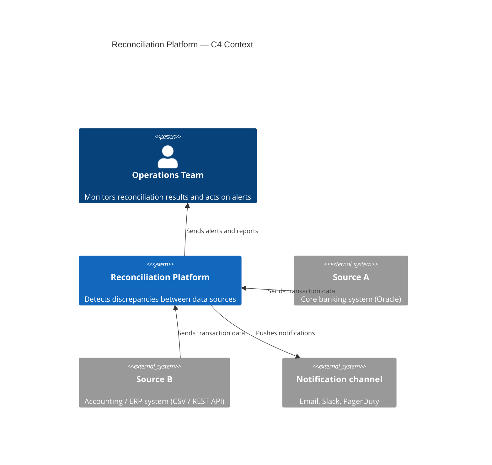
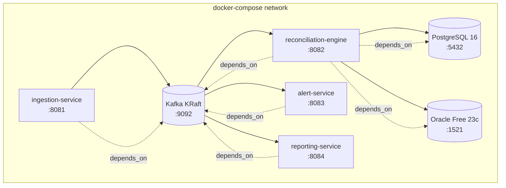

# Architecture & Design Decisions

## System Overview

The Reconciliation Platform is an event-driven system composed of four independent microservices. Data enters through `ingestion-service`, flows through Kafka, is processed by `reconciliation-engine`, and the results fan out to `alert-service` and `reporting-service`.



---

## Data Flow

```mermaid
sequenceDiagram
    participant SRC as Data Sources
    participant ING as ingestion-service
    participant K as Kafka
    participant REC as reconciliation-engine
    participant PG as PostgreSQL
    participant ORA as Oracle
    participant ALT as alert-service
    participant RPT as reporting-service

    SRC->>ING: Raw records (CSV / REST)
    ING->>ING: Normalise to canonical model
    ING->>K: Publish to topic: raw.transactions

    K->>REC: Consume raw.transactions
    REC->>PG: Read/write new-system records
    REC->>ORA: Read/write legacy-system records
    REC->>REC: Apply matching rules

    alt Records match
        REC->>K: Publish to topic: reconciliation.matched
    else Discrepancy found
        REC->>K: Publish to topic: reconciliation.discrepancies
    end

    K->>ALT: Consume reconciliation.discrepancies
    ALT->>ALT: Format and send notification

    K->>RPT: Consume both topics
    RPT->>RPT: Aggregate into status report
```

---

## Service Responsibilities

| Service | Port | Kafka Topics (in) | Kafka Topics (out) | Storage |
|---|---|---|---|---|
| ingestion-service | 8081 | — | `raw.transactions` | — |
| reconciliation-engine | 8082 | `raw.transactions` | `reconciliation.matched`, `reconciliation.discrepancies` | PostgreSQL + Oracle |
| alert-service | 8083 | `reconciliation.discrepancies` | — | — |
| reporting-service | 8084 | `reconciliation.matched`, `reconciliation.discrepancies` | — | PostgreSQL (read) |

---

## Key Design Decisions

### 1. Kafka in KRaft mode (no Zookeeper)

**Decision:** Use Apache Kafka >= 3.3 with KRaft metadata mode.

**Why:** Zookeeper adds an extra stateful dependency that must be sized, monitored, and upgraded separately. KRaft consolidates metadata management into Kafka itself, reducing operational overhead for local development and simplifying the production topology. KRaft has been production-ready since Kafka 3.3 (KIP-833).

**Trade-off:** KRaft is newer; teams with existing Zookeeper tooling need to retrain. Accepted because this is a greenfield service.

---

### 2. Two database engines (PostgreSQL + Oracle)

**Decision:** `reconciliation-engine` writes matched results to PostgreSQL 16 and reads legacy source data from Oracle Free 23c.

**Why:** Real reconciliation problems arise precisely because two systems store the same data differently. Running both engines locally faithfully reproduces this constraint. It also demonstrates fluency with Oracle — the dominant RDBMS in banking and insurance — without requiring a licence or paid image (`gvenzl/oracle-free` is free for development).

**Trade-off:** Oracle Free 23c has a slower cold-start (~60 s) than PostgreSQL. Mitigated by `depends_on` healthchecks in docker-compose so services wait for Oracle to be ready.

---

### 3. Maven multi-module over Gradle

**Decision:** Single parent POM with four child modules.

**Why:** The target sector (banking, financial services) standardised on Maven years ago. A multi-module Maven project is immediately recognisable to the hiring teams and Jenkins/Nexus pipelines they already operate. The BOM import pattern (`spring-boot-dependencies`, `testcontainers-bom`) centralises version management so child POMs declare only the dependency name, not the version — a pattern directly applicable to enterprise monorepos.

**Trade-off:** Gradle has faster incremental builds. Not a priority for a demonstration project.

---

### 4. Docker multi-stage builds

**Decision:** Each service's Dockerfile uses a two-stage build: `maven:3.9-eclipse-temurin-17` to compile, `eclipse-temurin:17-jre-alpine` to run.

**Why:** The builder stage image is ~700 MB (JDK + Maven cache). The runtime image is ~180 MB (JRE only). Keeping the Maven toolchain out of the final image reduces attack surface and registry costs.

---

### 5. Testcontainers for integration tests

**Decision:** Integration tests spin up real PostgreSQL and Oracle containers via Testcontainers, not H2 in-memory mocks.

**Why:** H2 and real PostgreSQL/Oracle differ in SQL dialect, constraint enforcement, and driver behaviour. Teams have shipped bugs that passed H2-backed tests but failed on production Oracle. Testcontainers run the same Docker images used in production, closing this gap. The cost is longer CI build times, accepted in exchange for higher confidence.

---

## Infrastructure Diagram (local docker-compose)



---

## Future Considerations

- **Schema registry** (Confluent Schema Registry or Apicurio) — enforce Avro/Protobuf contracts on Kafka topics.
- **Flyway** migrations — version-controlled DDL for PostgreSQL and Oracle schemas.
- **OpenTelemetry** — distributed tracing across all four services.
- **Kubernetes / OpenShift** — Helm charts per service; Strimzi operator for Kafka; ExternalSecret for credentials.
